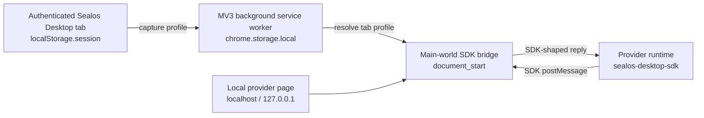

# Sealos App Dev Bridge

<div align="center">

**Run local Sealos Desktop apps with real Desktop SDK context, no temporary App CR required.**


[Overview](#overview) - [Getting started](#getting-started) - [Local verification](#local-verification) - [Architecture](#architecture) - [Documentation](#documentation)

</div>

## Overview

Sealos App Dev Bridge is a local developer browser extension for Sealos Desktop app development. It lets provider apps running on `localhost` receive the `sealos-desktop-sdk` master responses they normally receive inside Sealos Desktop, without creating a Sealos App CR that points to a local dev server.

The current implementation is a TypeScript Chrome Manifest V3 extension with profile capture, profile storage, tab-first profile selection, a main-world SDK bridge, popup/options workflows, automated Node tests, and a Playwright Chromium smoke test.

> [!IMPORTANT]
> This is a local development bridge, not an auth bypass. It reuses context captured from a real authenticated Sealos Desktop page and only injects into local development origins such as `localhost` and `127.0.0.1`.

## Why

Local Sealos provider development often needs the Desktop SDK context before the app can initialize. The old workaround is to create a temporary Sealos App CR that points at `localhost`, which adds cluster setup friction, pollutes app lists, and makes multi-cluster testing awkward.

This project keeps local iteration local:

- Capture authenticated Desktop session context once.
- Store multiple Sealos environment profiles in Chrome extension local storage.
- Select the profile for the current `localhost` tab from the popup.
- Let the provider app keep using its existing `createSealosApp()` and request/session code.
- Switch the same local port between online, staging, and test clusters without copying tokens by hand.

## Features

- **Chrome MV3 extension** with background, content, injected, popup, and options entrypoints.
- **Desktop profile capture** from `localStorage.session`, language, cloud config, and feature flags.
- **Multi-profile storage** using `chrome.storage.local`.
- **Tab-first profile resolution** so the current local tab selection wins over origin defaults and active-profile fallback.
- **Main-world SDK bridge** injected at `document_start` for local app pages.
- **Popup workflow** for capture, profile inspection, current-tab selection, and automatic reload.
- **Options workflow** for profile summaries, optional origin defaults, and metadata-only SDK message logs.
- **Secret-aware UI state** that redacts token and kubeconfig material from public summaries.
- **Automated verification** with TypeScript tests and a browser-level extension smoke test.

## SDK Coverage

The MVP answers the SDK calls most local providers need during startup:

| SDK API | Local bridge response |
| --- | --- |
| `user.getInfo` | Captured `SessionV1`, including user, subscription, token when present, and kubeconfig |
| `getLanguage` | Captured Desktop language |
| `getHostConfig` | Captured cloud config and feature flags |
| `account.getWorkspaceQuota` | Safe zero-quota fallback |
| `event-bus` | Safe local no-op for known app events such as `openDesktopApp`, `closeDesktopApp`, `requestLogin`, and `quitGuide` |

Unsupported SDK APIs return the Desktop-compatible failure message `function is not declare`.

## Getting Started

### Prerequisites

- Node.js LTS
- npm
- Chrome or Chromium with extension Developer Mode enabled
- Access to a real authenticated Sealos Desktop page for manual profile capture

### Install and Build

```bash
npm install
npm run build
```

The unpacked extension is generated at:

```text
extension/dist
```

### Load the Extension in Chrome

1. Open `chrome://extensions`.
2. Enable **Developer mode**.
3. Click **Load unpacked**.
4. Select `extension/dist`.
5. Pin **Sealos App Dev Bridge** for quick access.

### Capture a Desktop Profile

1. Open a real Sealos Desktop page and log in normally.
2. Open the extension popup on that Desktop tab.
3. Click **Capture Current Desktop Tab**.
4. Confirm the popup shows the profile name, Desktop origin, region UID, workspace or nsid, user, and captured time.

> [!WARNING]
> Do not continue with a profile you cannot identify. The active environment should be obvious before a local app receives it.

### Use the Profile for a Local App

1. Start a provider app locally, for example at `http://localhost:3000`.
2. Open the local app tab directly.
3. Open the extension popup on that tab.
4. Choose the intended captured profile.
5. Click **Use For This Tab**.
6. The extension stores the tab selection, reloads the local app, and closes the popup.

After reload, SDK calls from that tab resolve against the selected profile. Switching the selected profile later reloads the tab again so provider startup state stays consistent.

## Local Verification

Run the standard project checks:

```bash
npm run typecheck
npm test
npm run build
npm run smoke:extension
```

`npm run smoke:extension` launches Chromium with `extension/dist`, serves a fake Desktop page and local app fixture, captures a fake profile, selects it for a localhost tab through the popup, verifies SDK replies, and confirms the standalone failure behavior returns when the extension is disabled.

You can also serve the fixture manually after building and loading the extension:

```bash
npx --yes http-server extension/fixtures -p 3000
```

Then open `http://localhost:3000`, choose a captured profile for the tab, and send fixture SDK messages after the popup reloads the tab.

> [!NOTE]
> The automated smoke test covers extension wiring and SDK response behavior with fixtures. Real provider verification still requires a logged-in Desktop session and at least one local provider app.

## Manual Provider Checklist

Before calling a real app flow verified, check:

- `sealosApp.getSession()` succeeds in the local provider app.
- `user.getInfo`, `getLanguage`, `getHostConfig`, and quota calls receive expected responses.
- Provider API requests include the expected session-derived authorization header.
- Switching profiles changes local app behavior after reload.
- Disabling the extension restores the normal standalone failure path.
- The selected profile matches the intended Desktop origin, region, workspace, and user.

## Architecture



Profile resolution is deterministic:

1. Current tab profile selection from the popup.
2. Optional remembered profile for the local origin.
3. Active profile fallback.
4. No profile error asking the user to choose in the popup.

The page-side bridge runs in the main world so it can intercept same-window SDK messages. Chrome APIs stay in the isolated content script and background service worker.

## Safety Model

- No database writes.
- No Sealos App CR creation, update, or deletion.
- No remote transmission of kubeconfig, app token, or captured session data.
- No `chrome.storage.sync` for captured session payloads.
- No injection into arbitrary websites by default.
- No broad host permissions without a specific reason.
- Disabling or removing the extension rolls local apps back to their normal standalone behavior.

## Project Layout

```text
extension/
  manifest.json
  fixtures/
  src/
    background/
    content/
    injected/
    popup/
    options/
    shared/
scripts/
  build.mjs
  clean.mjs
  smoke-extension.mjs
tests/
docs/
```

Generated build output lives in `extension/dist` and is ignored by git.

## Commands

| Command | Description |
| --- | --- |
| `npm install` | Install dependencies |
| `npm run typecheck` | Run TypeScript type checking |
| `npm test` | Run Node test runner tests through `tsx` |
| `npm run build` | Build the unpacked Chrome extension into `extension/dist` |
| `npm run smoke:extension` | Run the browser-level extension smoke test |
| `npm run clean` | Remove generated extension output |

## Documentation

- [Product context](./PRODUCT.md)
- [Design system](./DESIGN.md)
- [Roadmap](./ROADMAP.md)
- [Architecture](./docs/architecture.md)
- [Information architecture](./docs/ia.md)
- [References](./docs/references.md)
- [Runbook](./docs/runbook.md)
